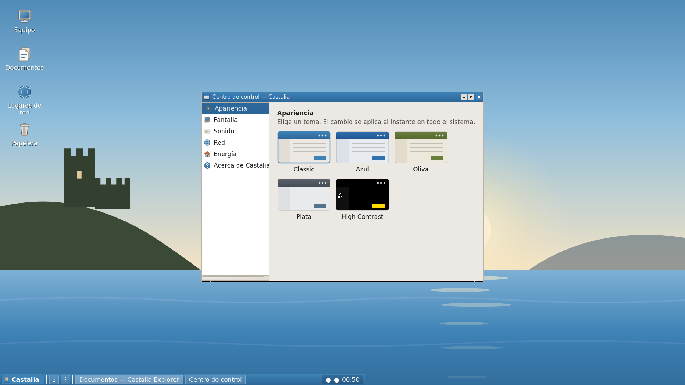
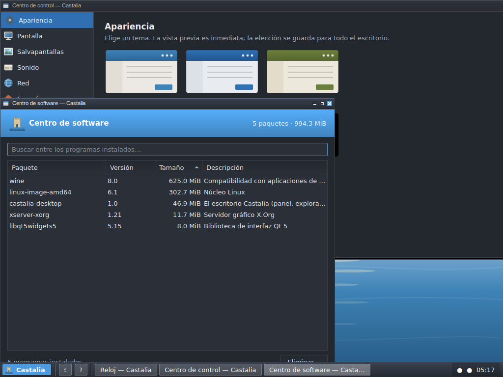

# Castalia OS — Castalia Classic Edition

**An original, legally-clean, XP-class desktop operating system for early- and
late-2000s PCs.** Built by **Tombatossals Softworks**.

> Familiar, but ours. Retro, but alive. Beautiful, but light.

Castalia Classic is a curated Linux distribution with a **custom Qt shell**
(Castalia Explorer + Control Center), an **XP-era-comfortable but entirely
original** user experience, and a **managed Wine / DOSBox-X / ScummVM
compatibility layer** — designed to run beautifully on Pentium 4, Pentium D,
Core Solo/Duo, Core 2 Duo, and contemporary AMD Athlon/Sempron/Turion machines.

It is **not** a Windows clone, contains **no** Microsoft code/branding/assets,
and is **not** "just a theme pack." See the design document below.

## 🖥️ It boots. It runs. It's real.

Castalia OS has grown from a design document into a **working operating system
that boots to its own graphical desktop** — verified in QEMU, screenshot below.



…and in **Medianoche**, the full-desktop dark mode — composed here by a real
window manager (Openbox with the Castalia decorations), not a mock-up:



**Visual tour:** [`docs/showcase.html`](docs/showcase.html) (self-contained).
**Reproduce it:**

```sh
sh build/mkiso.sh --edition live-desktop-amd64        # build the live ISO
python3 tests/qemu/screenshot.py \
    build/out/iso/castalia-live-desktop-amd64.iso --out desktop.png
```

Roadmap so far: **Phase 0** (research/PoC) · **Phase 1** (bootable base ISO) ·
**Phase 2** (graphical desktop) · **Phase 3** (Control Center) · **Phase 5**
(a real, tested installer — GUI + text, backend proven on a loopback disk) ·
**Phase 6** (Wine runs an original Win32 app) · **Phase 8** (Restore Points).
Plus a real EWMH taskbar and **46 native Qt 5 / C++17 apps** — all on a
de-systemd'd Debian base, themed from a single set of tokens, each rendered in
all seven themes (led by the warm **Human** flagship, with a **Medianoche**
dark mode) and gated in CI.

### The Human look (new flagship)

The shipped default is **Castalia Human** — a warm mid-2000s desktop:
chocolate titlebars, sun-orange accents, the **Human Dawn** wallpaper, a
**tangerine/tango icon family** (40 gradient SVG icons, every Start Menu
entry has one), an **original pointer theme** (9 hand-drawn Xcursor shapes,
multi-size, built from SVG by `tools/cursor_gen.py`), an **original sound
scheme** (seven short motifs synthesised from one spec file, played on real
events — session start/end, emptying the bin, errors), a **glass panel** and
Start Menu (token-derived specular gloss on the launch key and task buttons,
an accent bar that lights under the hovered menu entry — and flat fills in
High Contrast, where gloss would cost contrast), an animated shell
(menu rise-and-fade, icon hover halos, a launch ring when you open something,
a 200 ms dissolve when the wallpaper changes — all ≤200 ms and off under
`CASTALIA_REDUCE_MOTION=1`), an event-driven
taskbar (X PropertyNotify instead of per-second polling), rubber-band
selection on the desktop, a themed LightDM
greeter with a login banner, a **wallpaper picker** in the Control Center
that the desktop applies live (the photographic default plus six original
per-theme wallpapers, vector and raster alike), and an
installer with real step-by-step progress and an install slideshow.

### The app suite (all first-party, all original art)

- **Accessories** — Explorer, Notas (plain text), **Escritor** (WordPad-class
  rich text → HTML/ODT), Pintura, Calculadora, **Mapa de caracteres**,
  **Reloj** (analog + stopwatch + alarm), **Calendario** (month view + per-day
  notes; opens from the panel clock), **Reproductor multimedia** (playlist →
  mpv/VLC), **Lupa** (magnifier), **Notas
  adhesivas** (sticky notes), Captura de pantalla, Visor de imágenes,
  Archivos comprimidos.
- **Games** — **Buscaminas** and **Solitario**, clean-room and original-art,
  each with a head-less rules self-test in CI.
- **System** — **Papelera de reciclaje** (freedesktop Trash spec: restore /
  empty / delete), **Buscar archivos** (recursive file search in a background
  thread), Terminal (own VT100 emulator), Monitor, **Control de
  volumen** (over PulseAudio/ALSA; opens from the tray speaker), **Fecha y
  hora** (live clock, IANA time-zone picker + NTP over timedatectl),
  **Cuentas de usuario** (accounts from /etc/passwd; own-password change via
  the terminal), **Impresoras** (CUPS printers + print queue via lpstat;
  set-default and cancel-job), **Centro de redes** (interfaces, IPs, MAC and gateway via
  iproute2; Wi-Fi scan/connect and DHCP-or-static configuration over
  NetworkManager, with a status light in the panel tray), **Programas predeterminados** (default apps per
  category via xdg-mime), **Diagnóstico** (with a
  real CPU/RAM/disk/graphics/network benchmark suite), **Centro de software**
  (Add/Remove over dpkg/apt), **Centro de actualizaciones** (apt updates,
  auto-Restore-Point first), **Centro de recuperación** (Restore Points GUI),
  **Centro de hardware**
  (devices grouped by kind with the driver in use, read from sysfs so it works
  with no `pciutils`), **Administrador de discos** (disks and partitions over
  `lsblk`; mount/unmount, and format for removable media only, behind a typed
  confirmation), **Asistente de migración** (brings Documentos, Imágenes,
  Música, Escritorio and Favoritos across from an old Windows disk mounted
  **read-only**), and the
  **servidor de notificaciones** (a real `org.freedesktop.Notifications`
  server: corner toasts, history, per-app mute — so `notify-send` and
  third-party apps can reach the user).
- **Compatibility** — Gestor de aplicaciones de Windows (Wine) y **Juegos
  clásicos** (lanzador de DOSBox-X / ScummVM).
- **Two interface languages** — Castalia is *written* in Spanish (the source
  literals are what a Spanish user reads) and ships an **English** catalogue on
  top: the Start Menu and every app name in it, the desktop, taskbar, Alt+Tab,
  Run and shutdown dialogs, Escritor, the sticky notes and all seven pages of
  the Welcome/Help centre. Spanish stays the default *even on an
  `LANG=en_US` machine* — "follow the system" is a choice in **Centro de
  control → Idioma**, not an accident of the environment. The translator is
  installed from a Qt startup hook, before any `main()` runs, because Qt cannot
  retranslate widgets that already exist.
- **Accessibility** — **Teclado en pantalla** (on-screen keyboard that types
  via XTEST without stealing focus) and the Magnifier.
- Plus the **Centro de control**, **Bienvenida/Ayuda**, **Acerca de Castalia**
  (About box with live system info), **salvapantallas** (four original
  QPainter scenes — ondas, mystify, campo estelar and the theme-tinted
  **Aurora de Castalia**), the graphical
  **instalador**, and the **Restore Points** backend.

## 📖 The Project Bible

The complete design & technical roadmap lives in
**[`docs/PROJECT_BIBLE.md`](docs/PROJECT_BIBLE.md)** — 23 sections covering
philosophy, legal/branding strategy, the base-OS decision, system & shell
architecture, the visual design system, the built-in app catalog, the XP
feature-parity map, the compatibility strategy, packaging/updates, the
installer, security, performance budgets, the build system, the phased
roadmap, QA/hardware certification, documentation, branding/lore, a brutally
honest risk analysis, and the final recommendation.

## Headline decisions (see the bible for full justification)

| Area | Decision |
|------|----------|
| **Base OS** | Debian stable, de-systemd'd (Devuan/antiX lineage), i386 (SSE2) + amd64. Fallback: Void Linux. |
| **Init** | runit (SysVinit fallback) · eudev · elogind |
| **Display** | Xorg (Wayland deferred) · picom optional, off on low-end |
| **Toolkit** | Qt 5.15 LTS + C++17 for the shell and all first-party apps |
| **Compatibility** | Native-first, then Wine (per-app prefixes) · DOSBox-X · ScummVM |
| **Recovery** | Restore Points + independent Recovery env + Safe Mode |
| **Editions** | Castalia Classic **32 (SSE2)** and **64**; Legacy non-SSE2 is a post-1.0 stretch |

## Hardware floor & target

- **FLOOR:** Pentium 4 (SSE2), 512 MB RAM, GMA-class GPU, 800×600, 8 GB disk.
- **TARGET:** Core 2 Duo, 2 GB RAM, 1024×768+, 16 GB+ disk.
- Ethernet is first-class; Wi-Fi is best-effort; PS/2 + USB 1.1/2.0; CUPS/Samba.

## Repository layout

See [`docs/PROJECT_BIBLE.md` §17](docs/PROJECT_BIBLE.md#17-build-system-and-repository-structure)
for the full tree. Top level: `build/ docs/ branding/ themes/ shell/ apps/
installer/ packages/ iso/ tests/ tools/ third_party/ legal/ ci/`.

## Legal

Castalia OS is an independent project. **Windows is a registered trademark of
Microsoft Corporation; Tombatossals Softworks and Castalia OS are not
affiliated with, endorsed by, or sponsored by Microsoft.** No Microsoft code,
branding, icons, sounds, wallpapers, or UI assets are used. Every shipped asset
is original or licensed and tracked in
[`legal/ASSET_PROVENANCE.csv`](legal/ASSET_PROVENANCE.csv). See
[`docs/PROJECT_BIBLE.md` §3](docs/PROJECT_BIBLE.md#3-legal-and-branding-strategy).

Project source is under the terms in [`LICENSE`](LICENSE); bundled third-party
components retain their own licenses (see
[`legal/THIRD_PARTY.md`](legal/THIRD_PARTY.md)).

## Build, test & distribute

```sh
sh tests/run.sh                # quick QA: lint + unit + design/legal gates
sh tests/run.sh full           # + shell build, all-theme renders, live E2E
make -C build shell deb repo   # compile → castalia-desktop.deb → apt repo
sh build/mkiso.sh --edition live-desktop-amd64   # the graphical live ISO
```

Four pipelines keep all of that honest (see [`ci/README.md`](ci/README.md)):
**per-commit CI** (lint, unit suites, design/legal gates, every app rendered
in all seven themes, the live E2E of the whole suite under Openbox, and a
distribution gate that builds the `.deb`, installs it, runs it and
apt-resolves it from the generated overlay repo), a **nightly** full-ISO +
QEMU pipeline, an on-demand **desktop-ISO** proof, and a tag-driven
**release** pipeline that ships QEMU-boot-verified ISOs + packages +
checksums to a human-approved draft release
([`docs/RELEASING.md`](docs/RELEASING.md)).

## Status

**Actively implemented.** The design is complete (the bible) and a large part
of it now runs: a bootable live ISO, a graphical Openbox desktop with a real
EWMH taskbar, **46 native Qt apps** (a categorised Start Menu — Accesorios /
Juegos / Sistema / Compatibilidad / Accesibilidad, with a working power row:
**Bloquear · Cerrar sesión · Apagar** all reach the session/power dialog), a themed installer (GUI + text) over a
loopback-proven backend, a working Wine compatibility demo, and the full
system-tools trio — **Software Center**, **Update Center** (which auto-takes a
Restore Point before applying updates) and **Recovery Center** over a
unit-tested Restore Points engine. Each app is rendered offscreen in all seven
themes (light, dark and high-contrast) in CI **and driven end-to-end under a
real X server + Openbox** (every app must map, live and exit cleanly; the
session entry point must boot, supervise and log out); the two games and
every Python backend carry their own tests; the desktop ships as an
installable **`.deb` + apt overlay repo** with a tag-driven release pipeline;
and everything is proven with real QEMU / X / disk captures under
`docs/evidence/`. Remaining headline work: the media/DOSBox/ScummVM
launchers and 1.0 hardening (see the bible's §18 phases).
